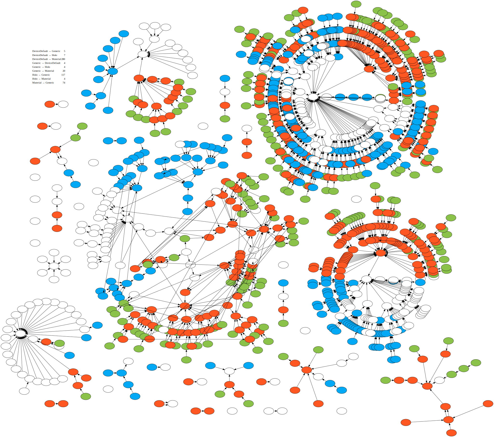

# style-inheritance-graph.py

Visualize inheritance between Android resource styles.


## Example output



The above image was generated by running this command:
```
style-inheritance-graph.py ~/path/to/aosp/frameworks/base/core/res | \
    twopi -Tsvg >out.svg
```


## Usage

The script reads one or more style files and produces a
[Graphviz](https://www.graphviz.org) .dot file. For best results, use twopi to
convert the .dot file to an SVG and display the latter in Chrome: nodes will
have a their names visible via a mouse-over tooltip.


## License

This project is licensed under the MIT License - see the [LICENSE](LICENSE)
file for details.
